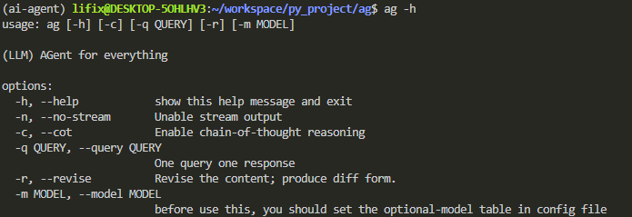
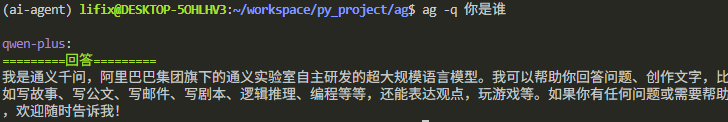
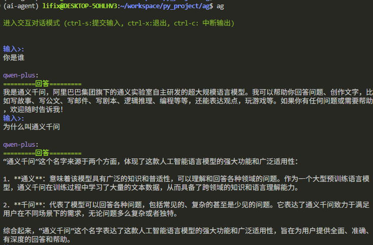
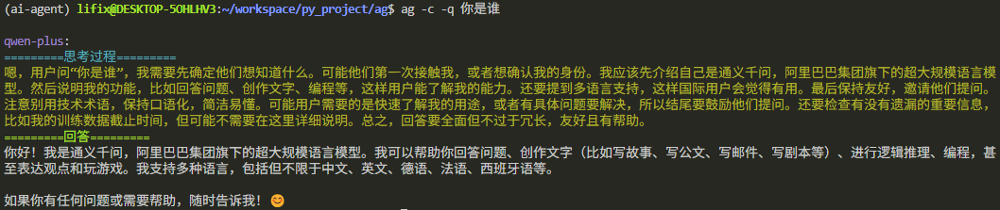
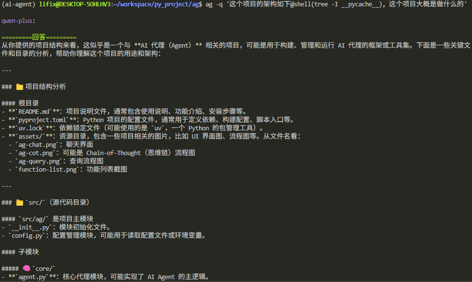

# ag - a command line ai agent 

`ag` allows you to use LLM in terminal.  

## key features


### 1. query


### 2. chat



To quit chat: `ctrl-x`  
To interupt output: `ctrl-c`

### 3. think of chain



## <font color=yellow>Spotlight</font>

### `@shell()`ag allow you to combine the shell command line standard output into prompt



### some other command supported `@dir` `@file`
- `@dir(path)`: show the path, equivalent to `@shell(ls path)`
- `@file(path)`: output the content of a file, equivalent to `@shell(cat path)`

## Usage

the config file is under the `~/.config/ag/config.toml`  

ag will use this file as the config file by default, here is it looks like:
```toml
[ag]
api_key = 'xxxxxx' # your api key
api_base = "https://xxxx" # your api base, your api supplier will tell you this
timeout = 10 # http timeout limit when you access online LLM
model = "qwen-plus" # the model name you want to use, check your api supplier

# these are optional models you can define, again check your api supplier
# with this table, you can do:
# ag -m 'dsv' to change the model when use ag

[ag.optional_models]
qwp = "qwen-plus"
qwt = "qwen-turbo"
qwpl = "qwen-plus-latest"
qwtl = "qwen-turbo-latest"
dsv = "deepseek-v3"
dsr = "deepseek-r1"
```

## Addition 

this project is still under developing and haven't be submitted to PyPI, if you want to have a taste of it, do this:

1. download [uv](https://docs.astral.sh/uv/reference/installer/#projects)
2. clone this repo
3. change to the root of the ag, then run `uv run ag` or activate the virtual environment `source .venv/bin/activate` then you can use `ag`

I didn't consider and test `ag` to run on windows, so it probably is gonna work on windows.

I will be very glad to hear your advices.
